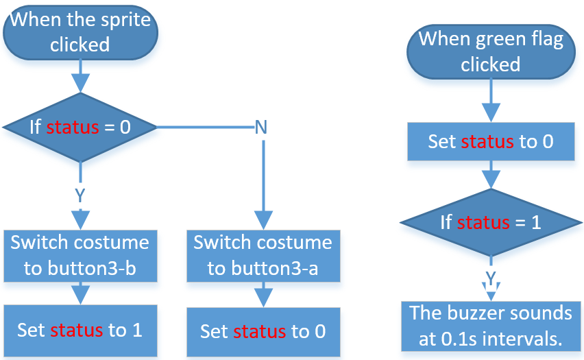

.. note::

    Hallo und willkommen in der SunFounder Raspberry Pi & Arduino & ESP32 Enthusiasten-Gemeinschaft auf Facebook! Tauchen Sie tiefer ein in die Welt von Raspberry Pi, Arduino und ESP32 mit anderen Enthusiasten.

    **Warum beitreten?**

    - **Expertenunterstützung**: Lösen Sie Nachverkaufsprobleme und technische Herausforderungen mit Hilfe unserer Gemeinschaft und unseres Teams.
    - **Lernen & Teilen**: Tauschen Sie Tipps und Anleitungen aus, um Ihre Fähigkeiten zu verbessern.
    - **Exklusive Vorschauen**: Erhalten Sie frühzeitigen Zugang zu neuen Produktankündigungen und exklusiven Einblicken.
    - **Spezialrabatte**: Genießen Sie exklusive Rabatte auf unsere neuesten Produkte.
    - **Festliche Aktionen und Gewinnspiele**: Nehmen Sie an Gewinnspielen und Feiertagsaktionen teil.

    👉 Sind Sie bereit, mit uns zu erkunden und zu erschaffen? Klicken Sie auf [|link_sf_facebook|] und treten Sie heute bei!

1.7 Türklingel
==================

Heute werden wir eine Türklingel bauen, klicke auf das Button3-Sprite auf der Bühne, der Summer ertönt; klicke erneut, der Summer hört auf zu ertönen.

.. image:: media/1.13_header.png

Erforderliche Komponenten
----------------------------------

.. image:: media/1.13_list.png

Bauen Sie den Stromkreis auf
------------------------------------

.. image:: media/1.13_image106.png

Laden Sie den Code und sehen Sie, was passiert
---------------------------------------------------------------

Lade die Code-Datei (``1.7_doorbell.sb3``) in Scratch 3.

Klicken Sie auf die grüne Flagge auf der Bühne. Wenn wir auf das Sprite **Button3** klicken, 
wird es blau und der Summer ertönt. 
Wenn wir erneut klicken, wird das Sprite Button3 wieder grau und der Summer hört auf zu ertönen.

Tipps zu Figur
----------------

Löschen Sie das Standard-Sprite und wählen Sie dann das Sprite **Button3** .

.. image:: media/1.13_scratch_button3.png

Dann setzen Sie die Größe auf 200.

.. image:: media/1.13_scratch_button3_size.png

Tipps zu Codes
------------------------

.. image:: media/1.13_buzzer4.png
  :width: 400

Mit diesem Block kannst du das Kostüm des Sprites wechseln.

.. image:: media/1.13_buzzer5.png
  :width: 400

Setzen Sie gpio17 auf niedrig, damit der Summer ertönt; stellen Sie ihn auf hoch und der Summer ertönt nicht.

Hier wird der Schalter status verwendet, und wir verwenden ein Flussdiagramm, um Ihnen das Verständnis des gesamten Codes zu erleichtern.

Wenn das grüne Flag angeklickt wird, wird der **Status** zuerst auf 0 gesetzt und gewartet, 
bis das Sprite zu diesem Zeitpunkt angeklickt wird; Wenn **button3** geklickt wird, 
wechselt es zum Kostüm als **button-b** Kostüm (blau) und der **Status** wird auf 1 gesetzt. 
Wenn das Hauptprogramm den **Status** erhält als 1 wird der Summer im 0,1s-Intervall ertönt. 
Wenn **button3** erneut geklickt wird, wechselt es zu **button-a** Kostüm (grau) und **status** wird wieder auf 0 gesetzt.

