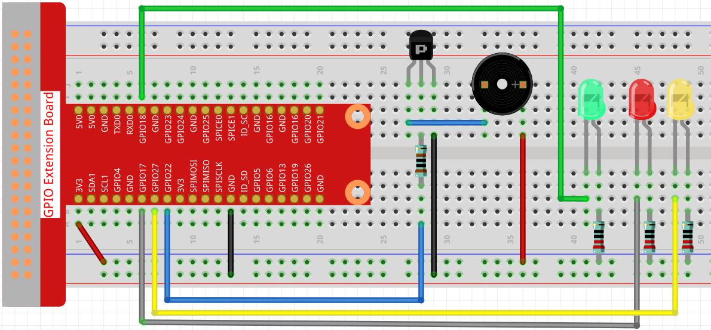
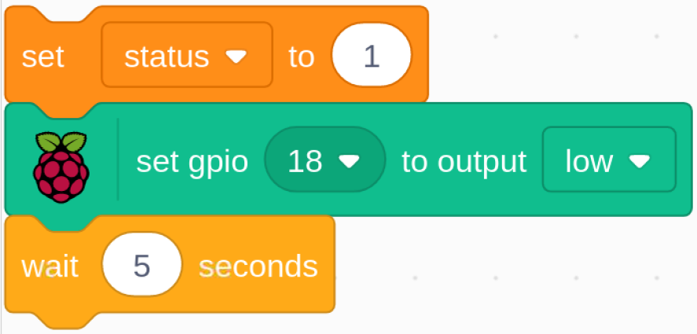
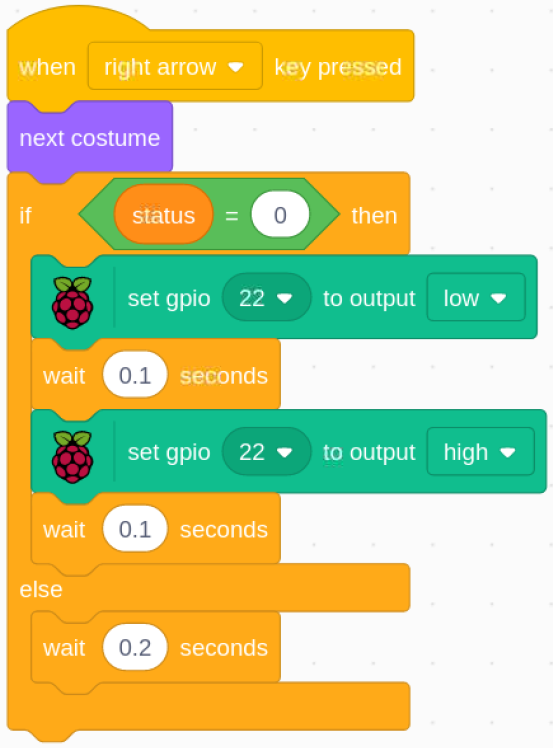

.. note:: 

    Ciao, benvenuto nella Community di appassionati di SunFounder Raspberry Pi, Arduino e ESP32 su Facebook! Approfondisci le tue conoscenze su Raspberry Pi, Arduino ed ESP32 insieme ad altri appassionati.

    **Perché unirsi?**

    - **Supporto Esperto**: Risolvi problemi post-vendita e sfide tecniche con l'aiuto della nostra comunità e del nostro team.
    - **Impara e Condividi**: Scambia consigli e tutorial per migliorare le tue competenze.
    - **Anteprime Esclusive**: Accedi in anticipo agli annunci dei nuovi prodotti e alle anteprime.
    - **Sconti Speciali**: Approfitta di sconti esclusivi sui nostri ultimi prodotti.
    - **Promozioni Festive e Giveaway**: Partecipa a promozioni festive e giveaway.

    👉 Pronto a esplorare e creare con noi? Clicca su [|link_sf_facebook|] e unisciti oggi stesso!

1.8 Un, Due, Tre, Stella
===========================

Oggi giocheremo a "Un, due, tre, stella!".

Clicca sulla bandiera verde per avviare il gioco, tieni premuta la freccia destra sulla tastiera per far avanzare il personaggio. Se la luce verde è accesa, il personaggio può muoversi; ma quando si accende il LED rosso, devi fermarlo; altrimenti il cicalino emetterà un suono continuo.

.. image:: img/1.14_header.png

Componenti Necessari
------------------------

.. image:: img/1.14_component.png

Costruire il Circuito
-----------------------

Carica il Codice e Osserva Cosa Succede
------------------------------------------

Carica il file di codice (``1.8_123_wooden_man.sb3``) su Scratch 3.

Quando il LED verde è acceso, puoi usare la freccia destra per controllare **Avery** e farlo camminare verso destra; quando il LED rosso è acceso, se continui a far muovere **Avery** a destra, un allarme suonerà.

Suggerimenti per lo Sprite
-----------------------------
Elimina lo sprite di default, quindi scegli lo sprite **Avery Walking**.

.. image:: img/1.14_wooden1.png
  :width: 400

Suggerimenti sul Codice
---------------------------

.. image:: img/1.14_wooden2.png
  :width: 400

Inizializza tutti i pin su alto.

All'inizio del gioco, assegna alla variabile stato il valore 1, indicando che lo sprite Avery Walking è in movimento, quindi imposta gpio18 su basso, che accende il LED verde per 5 secondi.

.. image:: img/1.14_wooden4.png
  :width: 400

Imposta gpio18 su alto, quindi imposta gpio27 su basso, spegnendo il LED verde e accendendo il LED giallo per 0,5 secondi.

.. image:: img/1.14_wooden5.png
  :width: 400

Assegna alla variabile stato il valore 0, indicando che lo sprite Avery Walking non è in movimento; quindi imposta gpio27 su basso e gpio17 su alto, spegnendo il LED giallo e accendendo il LED rosso per 3 secondi. Infine, imposta gpio17 su alto per spegnere il LED rosso.

Quando premiamo la freccia destra sulla tastiera, dobbiamo passare lo sprite **Avery Walking** al costume successivo per vedere Avery che cammina verso destra. Poi dobbiamo controllare il valore della variabile **status**. Se è 0, significa che Avery non dovrebbe muoversi in questo momento, e il cicalino suonerà per avvertirci di non premere di nuovo la freccia destra.
