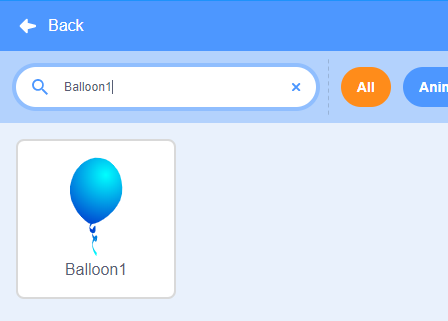
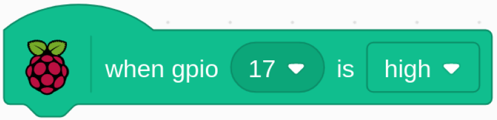
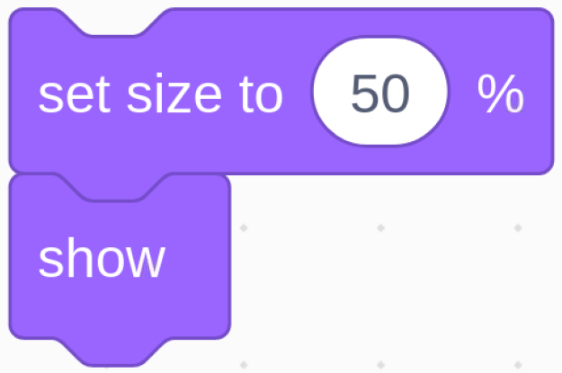
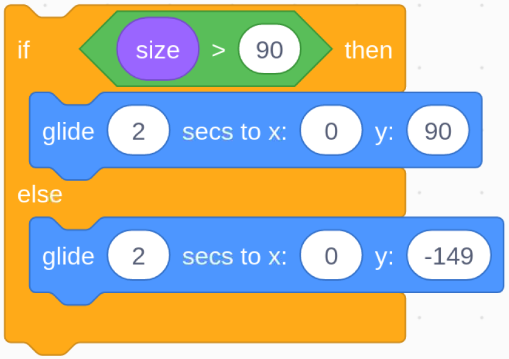

.. note::

    Hallo und willkommen in der SunFounder Raspberry Pi & Arduino & ESP32 Enthusiasten-Gemeinschaft auf Facebook! Tauchen Sie tiefer ein in die Welt von Raspberry Pi, Arduino und ESP32 mit anderen Enthusiasten.

    **Warum beitreten?**

    - **Expertenunterstützung**: Lösen Sie Nachverkaufsprobleme und technische Herausforderungen mit Hilfe unserer Gemeinschaft und unseres Teams.
    - **Lernen & Teilen**: Tauschen Sie Tipps und Anleitungen aus, um Ihre Fähigkeiten zu verbessern.
    - **Exklusive Vorschauen**: Erhalten Sie frühzeitigen Zugang zu neuen Produktankündigungen und exklusiven Einblicken.
    - **Spezialrabatte**: Genießen Sie exklusive Rabatte auf unsere neuesten Produkte.
    - **Festliche Aktionen und Gewinnspiele**: Nehmen Sie an Gewinnspielen und Feiertagsaktionen teil.

    👉 Sind Sie bereit, mit uns zu erkunden und zu erschaffen? Klicken Sie auf [|link_sf_facebook|] und treten Sie heute bei!

1.9 Aufblasen des Ballons
=================================

Hier spielen wir eine Ballonfahrt.

Durch Umschalten von Slide nach links, um den Ballon aufzublasen, wird der Ballon zu diesem Zeitpunkt immer größer. Wenn der Ballon zu groß ist, bläst er auf; Wenn der Ballon zu klein ist, schwebt er nicht in der Luft. Sie müssen beurteilen, wann Sie den Schalter nach rechts schieben müssen, um das Pumpen zu stoppen.

.. image:: media/1.15_header.png

Erforderliche Komponenten
--------------------------------------

.. image:: media/1.15_component.png

Baue die Schaltung
---------------------

.. image:: media/1.15_scratch_fritzing.png

Laden Sie den Code und sehen Sie, was passiert
-------------------------------------------------------

Laden Sie die Codedatei (``1.9_inflating_the_balloon.sb3``) in Scratch 3.

Durch Umschalten des Schiebereglers nach links, um mit dem Aufblasen des Ballons zu beginnen, wird der Ballon zu diesem Zeitpunkt immer größer. Wenn der Ballon zu groß ist, bläst er auf; Wenn der Ballon zu klein ist, schwebt er nicht in der Luft. Sie müssen beurteilen, wann Sie den Schalter nach rechts schieben müssen, um das Pumpen zu stoppen.

Tipps zu Figur
----------------

Löschen Sie das vorherige Sprite1-Sprite und fügen Sie dann das **Balloon1** -Sprite hinzu.

In diesem Projekt wird ein Ballonexplosions-Soundeffekt verwendet. Sehen wir uns also an, wie er hinzugefügt wurde.

Klicken Sie oben auf die Option **Sound** und dann auf **Upload Sound** um ``boom.wav`` 
von ``home/pi/davinci-kit-for-raspberry-pi/scratch/sound`` hochzuladen. Pfad zu Scratch 3.

.. image:: media/1.15_slide2.png

Tipps zu Codes
------------------------

Dies ist ein Ereignisblock, und die Triggerbedingung ist, dass gpio17 hoch ist, dh der Schalter wird nach links geschaltet.

.. image:: media/1.15_slide4.png
  :width: 400

Stellen Sie die Größenschwelle des Ballon1-Sprites auf 120 .

.. image:: media/1.15_slide7.png
  :width: 400

Verschieben Sie die Koordinaten des Sprites Balloon1 auf (0,0), die Mitte des Bühnenbereichs.

Stellen Sie die Größe des Balloon1-Sprites auf 50 ein und zeigen Sie es im Bühnenbereich an.

.. image:: media/1.15_slide5.png

Richten Sie eine Schlaufe zum Aufblasen des Ballons ein. Diese Schlaufe stoppt, wenn der Schieberegler nach rechts geschoben wird.

Innerhalb dieser Schleife wird die Ballongröße alle 0,1s um 1 erhöht, und wenn sie größer als ``maxSize`` ist, platzt die Sprechblase, woraufhin das Boom-Geräusch erzeugt und der Code verlassen wird.

Nachdem die letzte Schleife beendet wurde (Slider schaltet nach rechts), bestimmen Sie die Position des Balloon1-Sprites basierend auf seiner Größe. Wenn die Größe des Balloon1-Sprites größer als 90 ist, heben Sie ab (bewegen Sie die Koordinaten auf (0, 90), andernfalls landen Sie (bewegen Sie die Koordinaten auf (0, -149).

