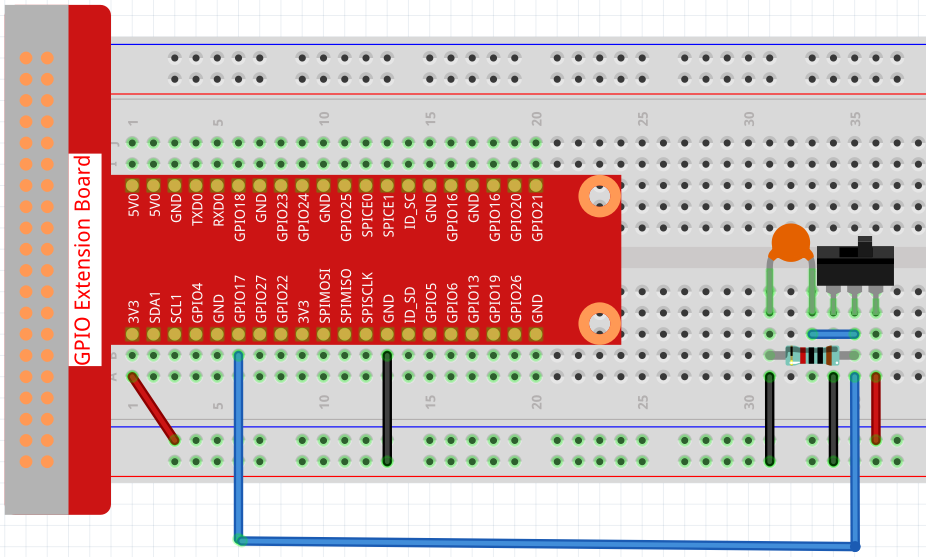
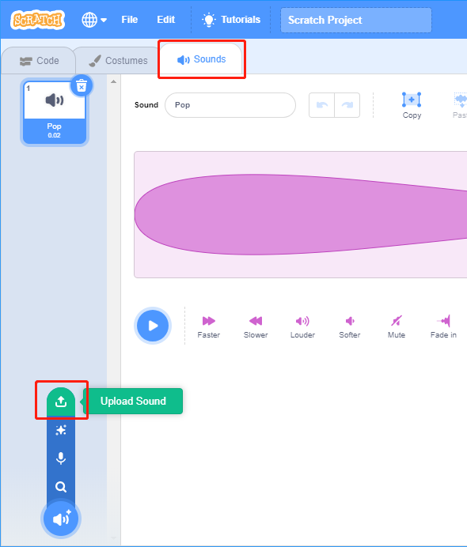
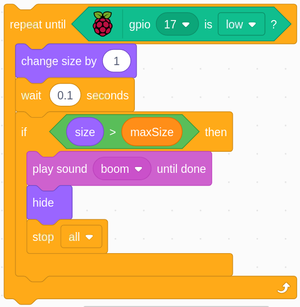

.. note::

    ¡Hola! Bienvenido a la comunidad de entusiastas de SunFounder para Raspberry Pi, Arduino y ESP32 en Facebook. Únete a otros apasionados y profundiza en el mundo de Raspberry Pi, Arduino y ESP32.

    **¿Por qué unirte?**

    - **Soporte Experto**: Resuelve problemas posventa y supera desafíos técnicos con el apoyo de nuestra comunidad y equipo.
    - **Aprende y Comparte**: Intercambia consejos y tutoriales para mejorar tus habilidades.
    - **Acceso Exclusivo**: Obtén acceso anticipado a anuncios de nuevos productos y adelantos especiales.
    - **Descuentos Especiales**: Disfruta de descuentos exclusivos en nuestros productos más recientes.
    - **Promociones Festivas y Sorteos**: Participa en sorteos y promociones durante las festividades.

    👉 ¿Listo para explorar y crear con nosotros? Haz clic en [|link_sf_facebook|] y únete hoy.

1.9 Inflando el Globo
=========================

Aquí, jugaremos un juego de inflar un globo.

Al mover el interruptor hacia la izquierda, el globo comenzará a inflarse y aumentará de tamaño. Si el globo es demasiado grande, explotará; si es demasiado pequeño, no flotará en el aire. Debes decidir cuándo mover el interruptor hacia la derecha para detener el inflado.

.. image:: img/1.15_header.png

Componentes Necesarios
-------------------------

.. image:: img/1.15_component.png

Construye el Circuito
------------------------

Carga el Código y Observa Qué Sucede
---------------------------------------

Carga el archivo de código (``1.9_inflating_the_balloon.sb3``) en Scratch 3.

Moviendo el interruptor hacia la izquierda, el globo comenzará a inflarse y aumentará de tamaño. Si el globo es demasiado grande, explotará; si es demasiado pequeño, no flotará en el aire. Debes decidir cuándo mover el interruptor hacia la derecha para detener el inflado.

Consejos sobre el Sprite
--------------------------

Elimina el sprite Sprite1 anterior, luego agrega el sprite **Balloon1**.

.. image:: img/1.15_slide1.png

Se usa un efecto de sonido de explosión de globo en este proyecto, veamos cómo se añadió.

Haz clic en la opción **Sonido** en la parte superior, luego haz clic en **Subir Sonido** para subir ``boom.wav`` desde la ruta ``davinci-kit-for-raspberry-pi/scratch/sound`` a Scratch 3.

Consejos sobre el Código
---------------------------

.. image:: img/1.15_slide3.png
  :width: 500

Este es un bloque de evento, y la condición de activación es que gpio17 esté en alto, es decir, que el interruptor se mueva hacia la izquierda.

.. image:: img/1.15_slide4.png
  :width: 400

Establece el umbral de tamaño del sprite Balloon1 en 120.

.. image:: img/1.15_slide7.png
  :width: 400

Mueve las coordenadas del sprite Balloon1 a (0,0), que es el centro del área de escenario.

.. image:: img/1.15_slide8.png
  :width: 300

Establece el tamaño del sprite Balloon1 en 50 y muéstralo en el área de escenario.

Configura un bucle para inflar el globo; este bucle se detiene cuando el interruptor se mueve hacia la derecha.

Dentro de este bucle, el tamaño del globo aumenta en 1 cada 0.1s, y si es mayor que ``maxSize``, el globo explotará, se reproducirá el sonido de explosión y el código finalizará.

.. image:: img/1.15_slide6.png
  :width: 600

Después de que el último bucle finaliza (el interruptor se mueve hacia la derecha), determina la posición del sprite Balloon1 según su tamaño. Si el tamaño del sprite Balloon1 es mayor que 90, despegará (mueve las coordenadas a (0, 90)), de lo contrario aterrizará (mueve las coordenadas a (0, -149)).

