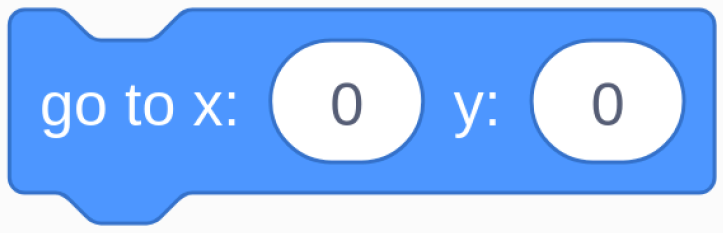

.. note:: 

    Ciao, benvenuto nella Community di appassionati di SunFounder per Raspberry Pi, Arduino ed ESP32 su Facebook! Approfondisci le tue conoscenze su Raspberry Pi, Arduino ed ESP32 insieme ad altri appassionati.

    **Perché unirsi?**

    - **Supporto Esperto**: Risolvi problemi post-vendita e sfide tecniche con l'aiuto della nostra comunità e del nostro team.
    - **Impara e Condividi**: Scambia consigli e tutorial per migliorare le tue competenze.
    - **Anteprime Esclusive**: Accedi in anticipo agli annunci dei nuovi prodotti e alle anteprime.
    - **Sconti Speciali**: Approfitta di sconti esclusivi sui nostri ultimi prodotti.
    - **Promozioni Festive e Giveaway**: Partecipa a promozioni festive e giveaway.

    👉 Pronto a esplorare e creare con noi? Clicca su [|link_sf_facebook|] e unisciti oggi stesso!

1.9 Gonfiare il Palloncino
=============================

Qui giocheremo a gonfiare un palloncino.

Spostando il cursore a sinistra, inizierai a gonfiare il palloncino, che diventerà sempre più grande. Se diventa troppo grande, esploderà; se resta troppo piccolo, non potrà sollevarsi in aria. Devi giudicare il momento giusto per spostare il cursore a destra e fermare il gonfiaggio.

.. image:: img/1.15_header.png

Componenti Necessari
------------------------

.. image:: img/1.15_component.png

Costruire il Circuito
-----------------------

.. image:: img/1.15_scratch_fritzing.png

Carica il Codice e Osserva Cosa Succede
------------------------------------------

Carica il file di codice (``1.9_inflating_the_balloon.sb3``) su Scratch 3.

Spostando il cursore a sinistra, inizierai a gonfiare il palloncino, che diventerà sempre più grande. Se diventa troppo grande, esploderà; se resta troppo piccolo, non potrà sollevarsi in aria. Devi giudicare il momento giusto per spostare il cursore a destra e fermare il gonfiaggio.

Suggerimenti per lo Sprite
----------------------------

Elimina il precedente sprite Sprite1, quindi aggiungi lo sprite **Balloon1**.

.. image:: img/1.15_slide1.png

In questo progetto è utilizzato un effetto sonoro di esplosione del palloncino; vediamo come aggiungerlo.

Clicca sull'opzione **Suono** in alto, quindi su **Carica Suono** per caricare il file ``boom.wav`` dal percorso ``home/pi/davinci-kit-for-raspberry-pi/scratch/sound`` su Scratch 3.

.. image:: img/1.15_slide2.png

Suggerimenti sul Codice
-------------------------
.. image:: img/1.15_slide3.png
  :width: 500

Questo è un blocco di evento, e la condizione di attivazione è che gpio17 sia alto, ovvero che l'interruttore sia spostato a sinistra.

.. image:: img/1.15_slide4.png
  :width: 400

Imposta la soglia di dimensione dello sprite Balloon1 su 120.

Sposta le coordinate dello sprite Balloon1 a (0,0), il centro dell'area di lavoro.

.. image:: img/1.15_slide8.png
  :width: 300

Imposta la dimensione dello sprite Balloon1 su 50 e visualizzalo nell'area di lavoro.

.. image:: img/1.15_slide5.png

Imposta un ciclo per gonfiare il palloncino, il quale si fermerà quando l'interruttore cursore sarà spostato a destra.

All'interno di questo ciclo, la dimensione del palloncino aumenta di 1 ogni 0,1s, e se supera ``maxSize``, il palloncino esploderà, attivando il suono di esplosione e terminando l'esecuzione del codice.

.. image:: img/1.15_slide6.png
  :width: 600

Dopo l'uscita dall'ultimo ciclo (quando il cursore è spostato a destra), determina la posizione dello sprite Balloon1 in base alla sua dimensione. Se la dimensione dello sprite Balloon1 è superiore a 90, sollevalo (sposta le coordinate a (0, 90)), altrimenti posizionalo a terra (sposta le coordinate a (0, -149)).
