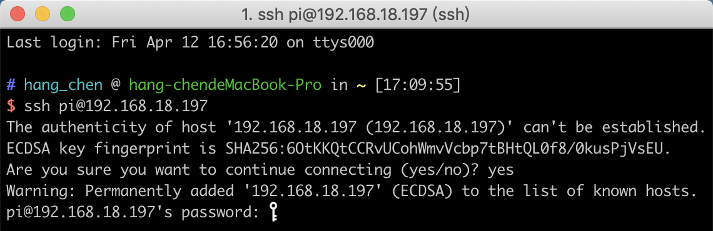

Set up Your Raspberry Pi
============================

If You Have a Screen
-------------------------

If you have a screen, it will be easy for you to operate on the
Raspberry Pi.

**Required Components**

================== =========================
Any Raspberry Pi   1 \* Power Adapter
1 \* Micro SD card 1 \* Screen Power Adapter
1 \* HDMI cable    1 \* Screen
1 \* Mouse         1 \* Keyboard
================== =========================

1) Insert the SD card you’ve set up with Raspberry Pi OS into the micro SD card slot on the underside of your Raspberry Pi.

1) Plug in the Mouse and Keyboard.

2) Connect the screen to Raspberry Pi’s HDMI port and make sure your screen is plugged into a wall socket and switched on.

.. note::
    If you use a Raspberry Pi 4, you need to connect the screen to the HDMI0 (nearest the power in port).

4) Use the power adapter to power the Raspberry Pi. After a few seconds, the Raspberry Pi OS desktop will be displayed.

    .. image:: media/image20.png
        :align: center

If You Have No Screen
--------------------------

If you don’t have a display, you can log in to the Raspberry Pi
remotely, but before that, you need to get the IP of the Raspberry Pi.

Get the IP Address
^^^^^^^^^^^^^^^^^^

After the Raspberry Pi is connected to WIFI, we need to get the IP
address of it. There are many ways to know the IP address, and two of
them are listed as follows.

**1.  Checking via the router**

If you have permission to log in the router(such as a home network), you
can check the addresses assigned to Raspberry Pi on the admin interface
of router.

The default hostname of the Raspberry Pi OS is **raspberrypi**, and you
need to find it. (If you are using ArchLinuxARM system, please find
alarmpi.)

**2. Network Segment Scanning**

You can also use network scanning to look up the IP address of Raspberry
Pi. You can apply the software, **Advanced IP scanner** and so on.

Scan the IP range set, and the name of all connected devices will be
displayed. Similarly, the default hostname of the Raspberry Pi OS is
**raspberrypi**, if you haven't modified it.

Use the SSH Remote Control
^^^^^^^^^^^^^^^^^^^^^^^^^^

We can open the Bash Shell of Raspberry Pi by applying SSH. Bash is the
standard default shell of Linux. The Shell itself is a program written
in C that is the bridge linking the customers and Unix/Linux. Moreover,
it can help to complete most of the work needed.

**For Linux or/Mac OS X Users**

**Step 1**

Go to **Applications**->\ **Utilities**, find the **Terminal**, and open
it.

.. image:: media/image21.png
    :align: center

**Step 2**

Type in **ssh pi@ip_address** . “pi”is your username and “ip_address” is
your IP address. For example:

.. code-block::

    ssh pi@192.168.18.197

**Step 3**

Input”yes”.

.. image:: media/image22.png
    :align: center

**Step 4**

Input the passcode and the default password is **raspberry**.

**Step 5**

We now get the Raspberry Pi connected and are ready to go to the next
step.

.. image:: media/image24.png
    :align: center

.. note::
    When you input the password, the characters do not display on
    window accordingly, which is normal. What you need is to input the
    correct password.

**For Windows Users**

If you're a Windows user, you can use SSH with the application of some
software. Here, we recommend **PuTTY**.

**Step 1**

Download PuTTY.

**Step 2**

Open PuTTY and click **Session** on the left tree-alike structure. Enter
the IP address of the RPi in the text box under **Host Name (or IP
address)** and **22** under **Port** (by default it is 22).

.. image:: media/image25.png
    :align: center

**Step 3**

Click **Open**. Note that when you first log in to the Raspberry Pi with
the IP address, there prompts a security reminder. Just click **Yes**.

**Step 4**

When the PuTTY window prompts “\ **login as:”**, type in
“\ **pi”**\ (the user name of the RPi), and **password: “**\ raspberry”
(the default one, if you haven't changed it).

.. image:: media/image26.png
    :align: center

**Step 5**

Here, we get the Raspberry Pi connected and it is time to conduct the
next steps.

**Note**: When you input the password, the characters do not display on
window accordingly, which is normal. What you need is to input the
correct password.

Note: If you are not satisfied with using the command window to control
the Raspberry Pi, you can also use the remote desktop function, which
can help us manage the files in the Raspberry Pi easily.

For details on how to do this, please refer to :ref:`Remote Desktop`.
