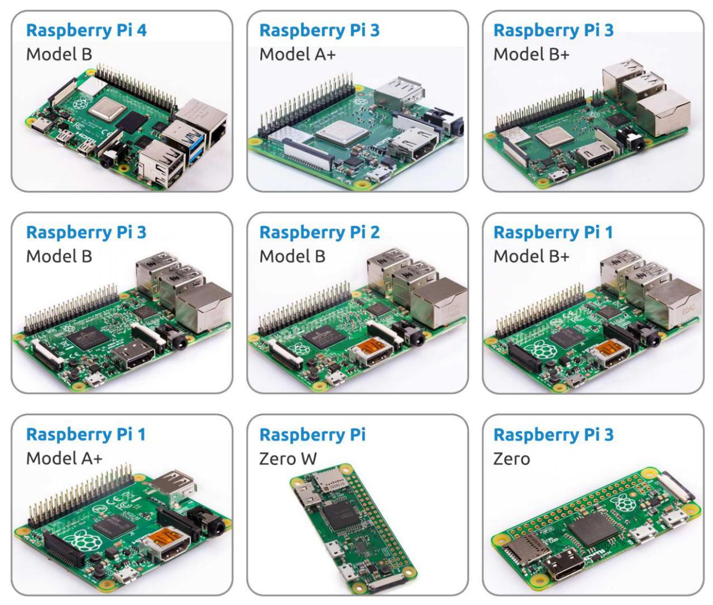

Was brauchen wir?
=======================

Erforderliche Komponenten
---------------------------------

**Raspberry Pi**

Der Raspberry Pi ist ein kostengünstiger Computer in Kreditkartengröße, der an einen Computermonitor oder Fernseher angeschlossen wird und eine Standard Tastatur und Maus verwendet. Es ist ein leistungsfähiges kleines Gerät, das Menschen mit allen Altern ermöglicht, Rechnung zu erforschen wie man in Sprachen wie Scratch und Python programmiert.

Unser Kit gilt für die folgenden Versionen des Produkts von Raspberry Pi:

**Netzteil**

Für den Anschluss an eine Steckdose verfügt der Raspberry Pi über einen Micro-USB-Anschluss (gleich wie bei vielen Mobiltelefonen). Sie benötigen eine Stromversorgung mit mindestens 2.5 Ampere.

**Micro SD Karte**

Ihr Raspberry Pi benötigt eine Micro-SD-Karte, um alle Dateien und das Raspberry Pi-Betriebssystem zu speichern. Sie benötigen eine Micro-SD-Karte mit einer Kapazität von mindestens 8 GB

Optionale Komponenten
-------------------------

**Bildschirm**

Um die Bidlshirm Umgebung von Raspberry Pi anzuzeigen, brauchen Sie einen Bildschirm, es kann ein Fernsehbildschirm oder ein Computermonitor sein. Wenn der Bildschirm hat eingebaute Lautsprecher, spielt der Pi über den Ton damit ab.

**Maus & Tastatur**

Wenn Sie einen Bildschirm verwenden, werden auch eine USB-Tastatur und eine USB-Maus benötigt.

**HDMI**

Der Raspberry Pi verfügt über einen HDMI-Ausgangsanschluss, der mit HDMI-Anschlüssen von meisten modernen Fernseh- und Computermonitore kompatibel ist. Wenn Ihr Bildschirm nur über DVI- oder VGA-Anschlüsse verfügt, müssen Sie die entsprechende Konvertierungsleitung verwenden.

**Tasche**

Sie können den Raspberry Pi in eine Tasche stecken; Auf diese Weise können Sie Ihr Gerät schützen.

**Ton oder Kopfhörer**

Der Raspberry Pi ist mit einem Audioanschluss von ca. 3,5 mm ausgestattet, Sie können den verwenden, wenn Ihr Bildschirm keine eingebauten Lautsprecher hat oder wenn es keinen Bildschirmsoperation gibt.